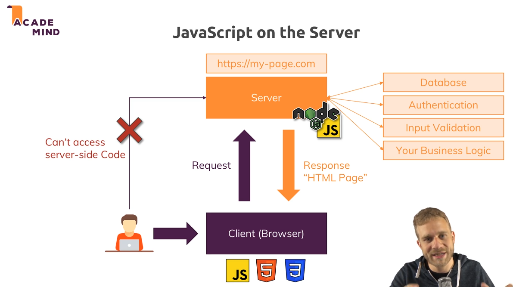
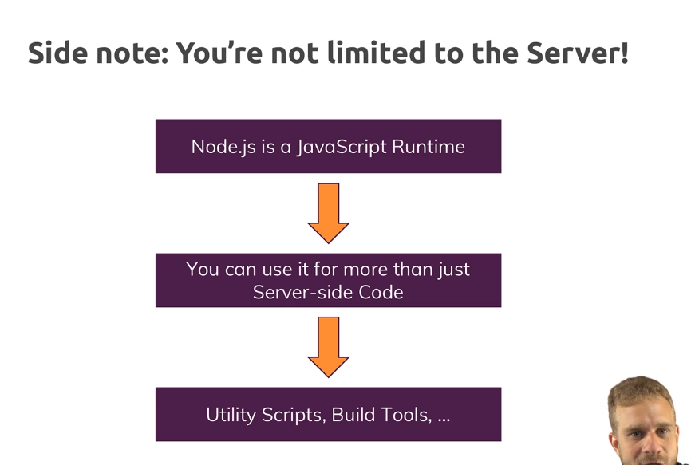
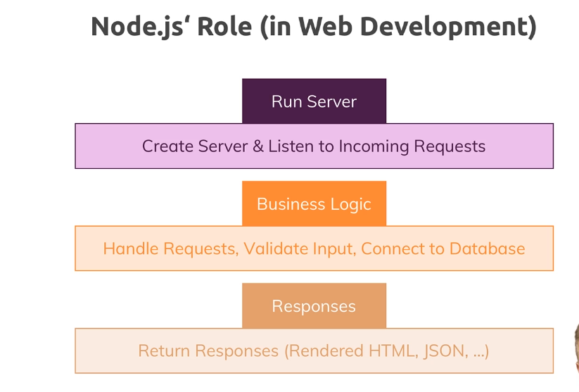

## Javascript on the Server

Now typically and also what we will do in this course, you use nodejs to run it on a server to write server side code and for that, we have to have a look at the full picture.

We have our users using a client computer with a browser, their mobile phone with a browser, even mobile apps and we will come back to how nodejs can communicate with these later in the course too but for now let's stick to the traditional browser picture.

We get our users using the browser and there we can use html, css and javascript, javascript in the browser to create webpages. Now they visit a page, mypage.com and they send a request to do so, for example by entering a url in the browser, a request is sent to that url.

Now there, this server comes into play. We got our server, some computer running in the Internet which has the IP associated with that domain which is automatically resolved for us and on that server, we then want to execute some code that does something with the incoming request and returns a response, often but not necessarily always as you will learn, this response is a html page which the browser then in turn can display. By the way, it is not necessarily just html, it's also things like css files or javascript files with javascript code for the browser, not for the server.

***Now on the server, we typically do tasks that we can't or don't want to do from inside the browser for performance or security reasons.***

We connect to databases for example to fetch and store data.

We do user authentication which we obviously can only do on a place the user can't access to make it more secure and avoid it being hacked.

We do it for input validation to see if a user entered a correct e-mail address, the browser can always be tricked, users can even edit their browser side code.

You can open the developer tools and start working on that page you're on but the server is of course sheltered from that, the user can't access it.

***And in general, we have our business logic on the server. Everything our user shouldn't see which takes too much time to run in the browser, where we obviously want to deliver a fast user experience or anything of that kind and that is where we use nodejs.***

## You're not limited to the server

## nodeJS' Role (in Web Development)

In general and that is the most popular thing you do with nodejs though, you use it in the context of web development and server side code.

So you use it to run a server and actually and that is an important difference to PHP.

for example, with nodejs you don't just write the code that is running on your server, you also write the server yourself, so the code that takes the incoming requests and routes them to your well other code. 

In PHP, you have extra tools like apache or nginx which run the servers which listen to incoming requests and then execute your php code, here nodejs does both.

It does that listening and it then also does whatever you want to do in your code,

And we also handle the response side not just incoming requests, you will also learn how you use nodejs to send back data to your clients, be that html pages, html pages with dynamic content or data only in the format of json or xml or even files.

## Alternatives

Alternatives to nodejs would be things like Python, also with frameworks like flask or Django or PHP wit frameworks like laravel maybe or standalone vanilla PHP of course and more, asp.net, Ruby on Rails, all that stuff, these basically are all replacements for nodejs or nodejs can be a replacement for them and there is no clear winner.

The huge advantage or one huge advantage of nodejs is that it uses Javascript, a language which you need so much in modern web development for all the frontend, for some build tools and if you then can also use it on the server side,