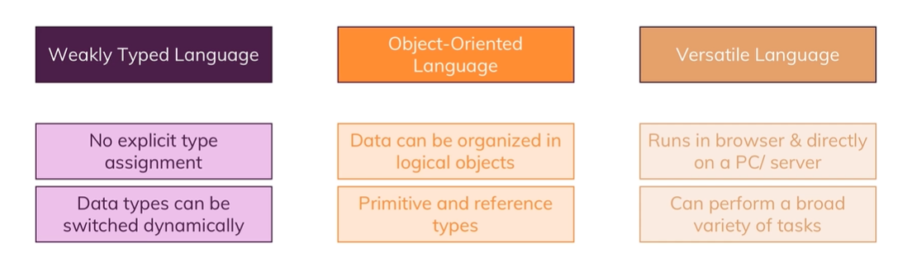

# JS in a Nutshell
## MDN link
[JavaScript — Dynamic client-side scripting](https://developer.mozilla.org/en-US/docs/Learn/JavaScript)
## JS Summary

>***Installing md/pdf converter***
https://github.com/puppeteer/puppeteer/blob/main/docs/troubleshooting.md  
sudo apt install libgtk-3-dev libnotify-dev libgconf-2-4 libnss3 libxss1 libasound2  
    VSCODE - F1 - Markdown pdf