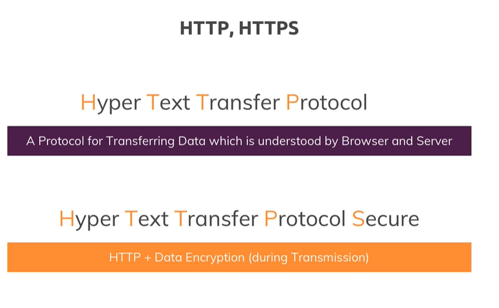

# How the web works

what happens behind the scenes is actually that the browser reaches out to some domain name servers to look that domain up because this domain is not really the address of your server, it's basically an encoded human readable version of that address you could say, your server itself has just an IP address but this is just some technical thing behind the scenes.

You write the code that runs on that computer in the Internet which has that IP address, you write the code that spins up that server which is able to handle the incoming request and do something with it.

request and response transmission is done through some protocol, so basically a standardized way of communicating you could say because obviously, to correctly handle a request and send back a response the browser can work with,
>HTTPS:  SSL encryption 