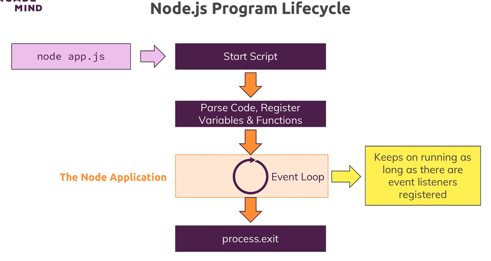

# Node Lifecycle & Event Loop


After creating the server, we never left that program.  
The reason for this is an important concept in nodejs called the event loop, this is basically a loop process which is managed by nodejs which keeps on running as long as there is work to do you could say, it keeps on running as long as there are event listeners registered and one event listener

we did register and we never unregistered is that incoming request listener we passed or we set up with the help of create server.

when we later access a database, you will see that there we also basically send that 'insert some data request' and then we register some function that should be executed once it's done. 
>And nodejs uses this pattern because it actually executes single threaded javascript. So the entire node process basically uses one thread on our computer it's running on.

behind the scenes, it does some multi-threading by leveraging the operating system. But this event loop is a core thing you have to keep in mind that nodejs basically has an ongoing loop as long as there are listeners and create server creates a listener which never stops but if you eventually were to unregister and you can do this with process.exit, it would end 
```js
const server = createServer((req, res) => {
  console.log(req);
  process.exit();
});
```
Process.exit basically hard exited our event loop and therefore the program shuts down because there was no more work to do,