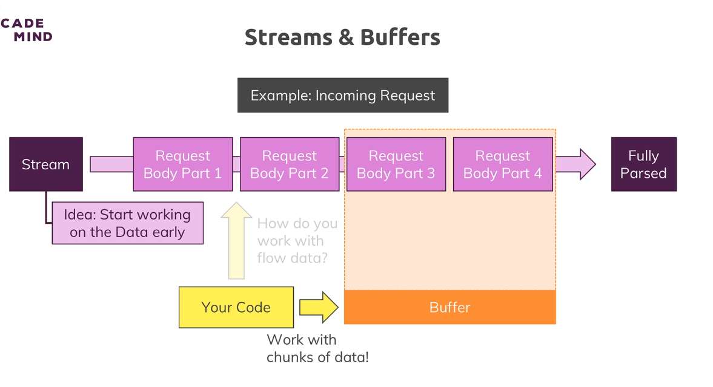

# Parsing Request Bodies
## Streams & Buffers

The incoming data is basically sent as a stream of data and that is a special construct javascript in general knows but nodejs uses a lot, now what is such a stream of data though?

Our stream here is basically an ongoing process, the request is simply read by node in chunks, in multiple parts and in the end at some point of time it's done.  
And this is done so that we theoretically can start working on this, on the individual chunks without having to wait for the full request being read.

streaming that data could make sense because it could allow you to start writing this to your disk, so to your hard drive where your app runs, your node app runs on your server whilst the data is coming in, so that you don't have to parse the entire file which is of course taking some time and you have to wait for it being fully uploaded before you can do anything with it.

>A buffer is simply a construct which allows you to hold multiple chunks and work with them before they are released once you're done and you work with that buffer