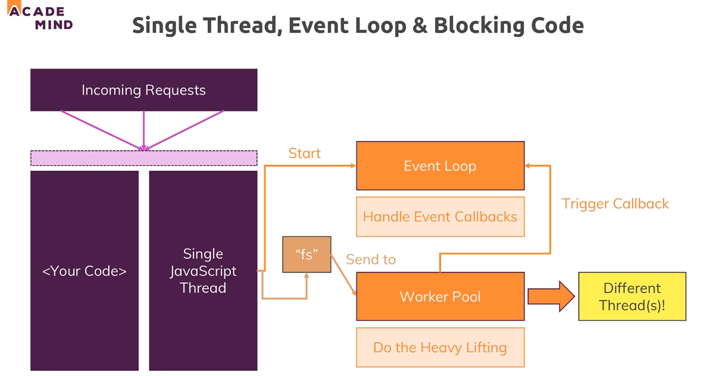
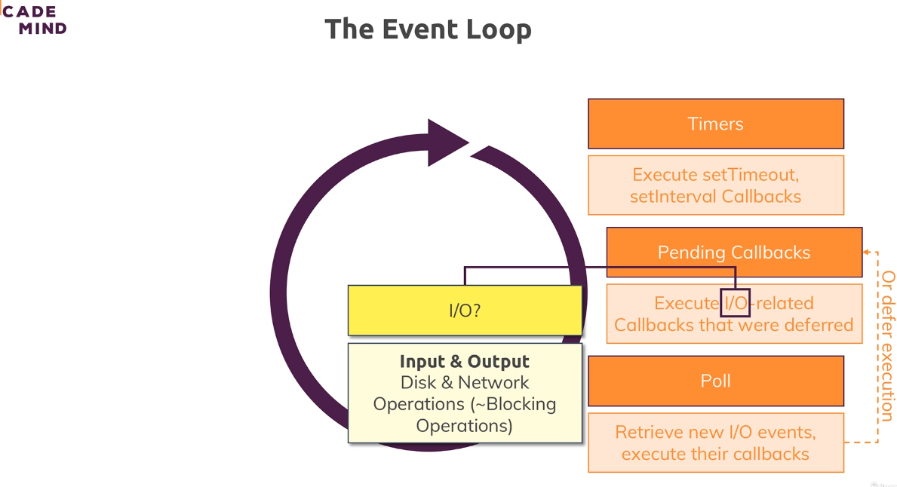
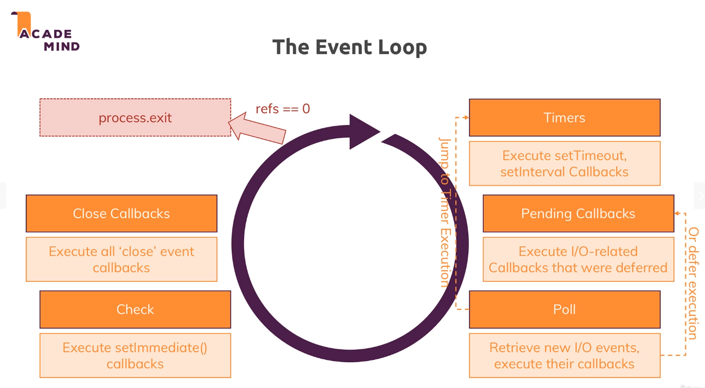

# Node.js - Behind the scenes

## Event Loop & Worker Pool

the event loop is automatically started by nodejs when your program starts, This is responsible for handling event callbacks.  

so all these nice functions we basically added thus far in create server for example, the event loop is responsible for basically running that code when a certain event occurs 

That doesn't help us with our long taking file operation though and it's important to understand that this operation is not handled by the event loop, just the callback that we might have defined on write file once it's done, that code will be handled in event loop but that code will finish fast.

Instead our file system operation and a couple of other long taking operations are sent to a worker pool which is also spun up and managed by nodejs automatically. This worker pool is responsible for all the heavy lifting.

This worker pool is kind of totally detached of your javascript code you could say and it runs on different threads, it can spin up multiple threads, it's closely intervened with your operating system you're running the app on, so this is really detached from your code and this worker pool is therefore doing all the heavy lifting.

The one connection to the event loop we will have though is that once the worker is done, so for example once we read a file, it will trigger the callback for that read file operation and since the event loop is responsible for the events and the callbacks, this will in the end end up in the event loop.

## Event Loop

Now be aware that with IO here, I mean generally any input output operations that typically is file operations but can also be network operations and in general, I'm talking about blocking long taking operations.

Now it's important to understand that nodejs will leave that phase at a certain point of time and that can also mean that if there are too many outstanding callbacks, it will continue its loop iteration and postpone these callbacks to the next iteration to execute them. After working on these open callbacks and hopefully finishing them all, it will enter a poll phase.

The poll phase is basically a phase where nodejs will look for new IO events and basically do its best to execute their callbacks immediately if possible. Now if that's not possible, it will defer the execution and basically register this as a pending callback,

Important, it also will check if there are any timer callbacks due to be executed and if that is the case, it will jump to that timer phase and execute them right away,

Now we're nearing the end of each iteration cycle and now nodejs will execute all close event callbacks, so if you registered any close events and in our code, we haven't but if you had any close events, this would be the point of time where nodejs executes their appropriate callbacks.

Well and then we might exit the whole nodejs program but only if there are no remaining event handlers which are registered and that is what I mean with this refs equal null thing here. Internally nodejs keeps track of its open event listeners and it basically has a counter, references or refs which it increments by 1 for every new callback that is registered, every new event listener that is registered.  
It reduces that counter by 1 for every event listener that it doesn't need anymore.

In a server environment,  we create a server with create server and then listen to incoming requests with listen, this is an event which never is finished by default and therefore, we always have at least one reference and therefore we don't exit in a normal node web server program. We can call the exit function as you already saw