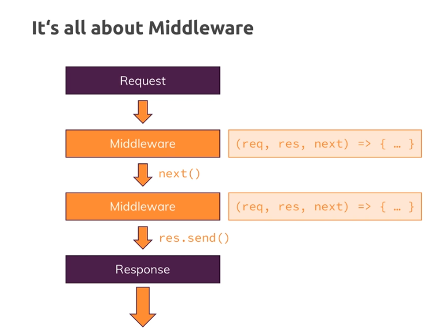

# Middleware

Expressjs is all about middleware and you see a diagram here, middleware means that an incoming request is *automatically funneled through a bunch of functions by expressjs*.

so instead of just having one request handler, you will actually have a **possibility of hooking in multiple functions which the request will go through until you send a response.**

This allows you to split your code into multiple blocks or pieces instead of having one huge function that does everything.
This is the pluggable nature of expressjs, where you can easily add other third party packages which simply happen to give you such middleware functions that you can plug into expressjs and add certain functionalities.

## use()
So this is a core concept of expressjs: the middleware. And we can use that by going here after we created the app object but before we passed it to create server and then we can use the app and call a method which is defined by the express framework, `use()`.
> `use()` allows us to add a new middleware function, it accepts an array of so-called request handlers

<ins>this function you pass to app use will be executed for every incoming request</ins> and this function will receive three arguments:

- the request
- the response object
- a third argument which is the **next argument.**

`next` is actually a function, a function that will be passed to this function by expressjs and this can be confusing because you are passing a function as an argument to the `use()` method and this function you're passing is receiving yet another function here on the next argument.

>and this next argument, basically this function you're receiving here has **to be executed to allow the request to travel on to the next middleware.**

**IMPORTANT:** our page will keep on spinning,  so we don't get a response which makes sense because we've got no logic where we would send one.  

If we don't call next, we should actually send back a response because otherwise the request can't continue its journey, so it will never reach a place where we might send a response.

[https://www.color-hex.com/color-palettes/](https://www.color-hex.com/color-palettes/)    