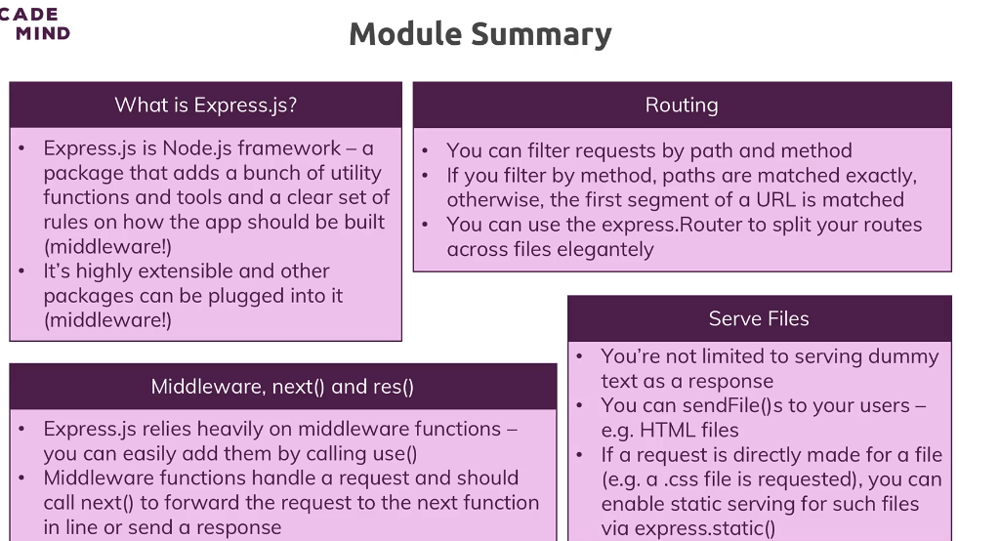

# Express.js: Wrap Up

By using expressjs, a powerful framework and that is what expressjs is. It's a nodejs framework, so you still use nodejs.

We for example still use the path core module in this module but you build up on it and get a bunch of utility functions and a clear set of rules on how you should structure your app and it's all about middleware and understanding that flow of requests through all the middleware functions.

