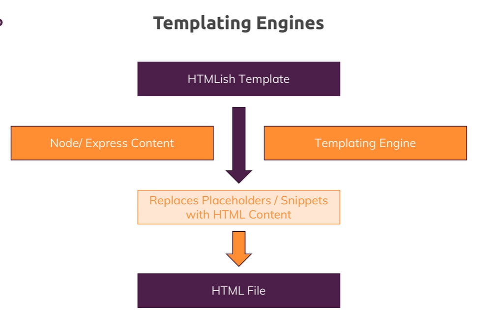

# Working with Dynamic Content  & Adding Templating Engines

## Sharing Data Across Requests & Users

If we are now in Firefox here and I also visited localhost 3000.

So this is a totally different browser and this is kind of like a brand new user, it doesn't share any cookies with the other browser, nothing of that kind, it used the same IP address but that doesn't matter here.
if we visit the `/add-product` route, we see that our `const products = array ` is actually **data which is inherent to our node server** as it is running and therefore, it's shared across all users.

**<span style='color:   #875c5c'>Important:** actually you will probably never implement this, you always want to fetch data for a specific request and if that happens to be the same data you show for all users that send this request, this is fine.

But sharing this data across requests, across users is typically something you don't want to do because if you now edit this with user A, user B will see the updated version.

>So this is a pattern we can use for now here and it's fine for practicing what we want to practice here but later we'll learn about a technique to share data in memory here, in the node app across different requests but only for one and the same user and not across users because now we have shared data across requests and across users.  
we will also use database.

## Templating Engines


A templating engine understands a certain syntax for which it scans your html-ish template and where it then replaces placeholders or certain snippets depending on the engine you're using with real html content but that content, this **html content it uses there is generated on the fly, on the server by the templating engine taking that dynamic content into account.**
>With a templating engine, in the end, the result will be dynamically, on the fly generated html file which is then sent back to your users.  
So the users never see the template, they never see the placeholders, **all that happens on the server,** they just get a normal html page but it's not hardcoded 

The 3 most popular templating engines are:
- EJS
- Pug (Jade)
- Handlebars

## Installing &  Implementing Pug

**<span style='color: #bcdbf9'> Note:** remember that we must quit the development server when we install another package.

`npm install --save ejs pug express-handlebars` (So let's install them with npm install --save because all three engines are part of our node code and ship with the code we deploy on some computer in the end)

We need to install a global configuration value; `app.set()` allows us to set any values globally on our express application  
[https://expressjs.com/en/api.html#app.set](https://expressjs.com/en/api.html#app.set)


| Property    | Description | Default |
| -------- | ------- | ------- |
| view engine  | The default engine extension to use when omitted. NOTE: Sub-apps will inherit the value of this setting.    | |
| views | 	A directory or an array of directories for the application's views. If an array, the views are looked up in the order they occur in the array. | `process.cwd() + '/views'` |

```js
app.set('view engine', 'pug');
```
**<span style='color: #bcdbf9'> Note:** **Pug** engine actually ships with built in express support and auto registers itself with express.  
Pug is supported out of the box and with that, we're already set to go.


>**<span style='color: #cc9464'> HACK:** Thanks to our IDE/Emmet, if you `CTRL+Enter HTML:5`, we get a **Pug** structure.  
Keep in mind that the **Pug** templating engine will compile our code to normal html in the end.

Indentation matters with **Pug**, to manage siblings.

As we defined that all the views are in the `/views` folder, we also don't have to construct a path to that folder instead we can just say `'shop'`.  
We also don't need shop.pug because we defined pug as the default templating engine so it will look for `.pug file`

From shop.js,
```js
router.get('/', (req, res, next) => res.render('shop'));
```
## Official Pug Documentation
[https://pugjs.org/api/getting-started.html](https://pugjs.org/api/getting-started.html)

## Adding a Layout
**<span style='color: #bcdbf9'> Note:** we can define some hooks in the base layout, and other views that will extend the base layout, can add more *links references* for example (you can choose whatever name after the reserved keyword **block**):     
`block styles`  
`block content`

**<span style='color: #a8c62c'> main-layout.pug:** 

```html
<!DOCTYPE html>
html(lang="en")
    head
        meta(charset="UTF-8")
        meta(name="viewport", content="width=device-width, initial-scale=1.0")
        meta(http-equiv="X-UA-Compatible", content="ie=edge")
        title #{pageTitle}
        link(rel="stylesheet", href="/css/main.css")
        block styles
    body   
        header.main-header
            nav.main-header__nav
                ul.main-header__item-list
                    li.main-header__item
                        a(href="/", class=(path === '/' ? 'active' : '')) Shop
                    li.main-header__item
                        a(href="/admin/add-product", class=(path === '/admin/add-product' ? 'active' : '')) Add Product
        
        block content
```

**<span style='color: #a8c62c'> 404.pug:** 
```html
extends layouts/main-layout.pug

block content
    h1 Page Not Found!
```
**<span style='color: #a8c62c'> add-product.pug:** 
```html
extends layouts/main-layout.pug

block styles
    link(rel="stylesheet", href="/css/forms.css")
    link(rel="stylesheet", href="/css/product.css")

block content
    main
        form.product-form(action="/admin/add-product", method="POST")
            .form-control
                label(for="title") Title
                input(type="text", name="title")#title
            button.btn(type="submit") Add Product
```

## Finishing Pug template
### Active item `navbar`

**<span style='color: #a8c62c'> admin.js:** 
```js
router.get('/add-product', (req, res, next) =>
  res.render('add-product', { pageTitle: 'Add Product', path: '/admin/add-product' })
);
```
**<span style='color: #a8c62c'> main-layout.pug:** 
```
li.main-header__item
    a(href="/", class=(path === '/' ? 'active' : '')) Shop
li.main-header__item
    a(href="/admin/add-product", class=(path === '/admin/add-product' ? 'active' : '')) Add Product
```

### Passing the PageTitle
*Option 1*: we could create a block section in **<span style='color: #a8c62c'> main-layout.pug:**  , and define it in our views

*Option 2*: we use a dynamic field in **<span style='color: #a8c62c'> main-layout.pug:**   
`title #{pageTitle}`

**<span style='color:   #875c5c'>IMPORTANT:** we need to make sure that in all our `res.render()` function, we pass that `pageTitle` key.

## Working with Handlebars

### Official Handlebars Documentation
[https://handlebarsjs.com/](https://handlebarsjs.com/)

### Set-up
**<span style='color: #bcdbf9'> Note:** Unlike Pug, Handlebars is not auto-installed by Express,js, so we manually have to tell express that there is such an express handlebars engine available.

so that object we just imported, that just turns out to be a function that we can call to basically initialises this engine 

**<span style='color:   #875c5c'>IMPORTANT:** **applies up to version 3**

```js
import expressHbs from 'express-handlebars';
app.engine('handlebars', expressHbs());
app.set('view engine', 'handlebars');
```
Note that the extension for you files in `views` folder,  will follow the convention you defined your app.set() function  
- 'handlebars' => **<span style='color: #a8c62c'> *404*.handlebars**  
- 'hbs' => **<span style='color: #a8c62c'> *404*.hbs**

**<span style='color:   #875c5c'>IMPORTANT:** **set-up with current version (at the the time of the course 7.1.2**  
[https://www.npmjs.com/package/express-handlebars](https://www.npmjs.com/package/express-handlebars)

```js
import { engine } from 'express-handlebars';
app.engine('handlebars', engine());
app.set('view engine', 'handlebars');
app.set('views', './views');
```
you must have a **<span style='color: #a8c62c'>main.handlebars** file under `/views/layouts`

### Handlebars syntax
Handlebars uses normal html with some custom syntax, there is no minimal html version as it was with Pug.
```html
<title>{{ pageTitle }}</title>
```

Handlebars just supports output of keys that yield true or false.  
`{{ #if prods.length > 0}}`  

Now this means that we have to move that logic from the template into our
 Node Express code and pass the result of this check into the template.

This is a core difference to Pug already besides that html syntax. In Handlebars, we can't run any logic in our handlebars template, we just can output single property, single variables and their value and we can only use these in `if blocks`.

**<span style='color: #bcdbf9'> Note:** it might sound very complex but it forces us to put all our logic into the node express code where our logic typically should live and keep our templates lean because if you put too much logic in your templates, it can be hard to understand your code because you always have to check both, your express code and your templates

## Adding a Layout with Handlebars
you define layout folder and default template:  
```js
app.engine('handlebars', engine({layoutsDir: 'views/layouts/', defaultLayout: 'main-layout'}));
```

Unlike Pug , you can't define block section, instead the only thing we can do there is we can define a placeholder with three curly braces, `{{{body}}}`

However if you have some part like this where you need to add some styling depending on the page you are on, you will have to solve this differently, in a kind of a similar approach as we solved the active lass here in pug, you will have to add an if statement here in your main layout

**<span style='color: #a8c62c'>main-layout.handlebars**  
```js
{{#if productCSS}}
    <link rel='stylesheet' href='/css/forms.css' />
{{/if}}
{{#if formsCSS}}
    <link rel='stylesheet' href='/css/product.css' />
{{/if}}

<li class='main-header__item'>
    <a class='{{#if activeShop}}active{{/if}}' href='/'>Shop</a>
</li>
<li class='main-header__item'>
    <a class='{{#if activeAddProduct}}active{{/if}}' href='/admin/add-product'>Add Product</a>
</li>
```

**<span style='color: #a8c62c'>shop.js**  
```js
router.get('/', (req, res, next) =>
  res.render('shop', {
    prods: adminData.products,
    pageTitle: 'My Shop',
    path: '/',
    hasProducts: adminData.products.length > 0,
    activeShop: true,
    productCSS: true,
  })
);
```

**<span style='color: #bcdbf9'> Note:**  for any views you can pass `layout: false` in your `res.render()`, this is a special key that is understood by handlebars and it would not use the default layout,

### renaming .handlebars extension to .hbs
**<span style='color: #a8c62c'>app.js**, you have to add an extname property in your engine configuration:
```js
app.engine(
  'hbs',
  engine({
    layoutsDir: 'views/layouts/',
    defaultLayout: 'main-layout',
    extname: 'hbs',
  })
);
app.set('view engine', 'hbs');
app.set('views', './views');
```

## Working with EJS

### Official EJS Documentation
[http://ejs.co/#docs](http://ejs.co/#docs)

EJS is a templating engine which is just like pug, supported out of the box so we don't need to register the engine as we did it with handlebars.

It has a nice mixture of the extended functionalities of Pug, and uses normal HTML.

ejs does not support layouts but we will find a solution to at least have some kind of reusability of certain building blocks

**<span style='color: #bcdbf9'> Note:** we can write normal javascript code in blocks like `if`, `for`:
```html
<% if (prods.length >0) %>

<% if (prods.length >0) { %>
    <div class="grid">
    <% for (let product of prods) { %>
    <article class="card product-item">
```
## Working on layouts with EJS Partials
One thing that is missing here is the layout functionality pug or handlebars gave us and indeed ejs doesn't have layouts but we can use so-called **partials or includes**, by the way a feature that pug and handlebars also know.

Instead of having one master layout where you put your individual view parts into, you have a couple of separated shared view parts which you can merge into the views

Create a folder `includes` under `/views`

to use our **partials**, taking the example of **<span style='color: #a8c62c'>404.ejs**
We need to import it and this can be imported into the 404.ejs file by adding our ejs syntax, using a **minus sign** and you use that if you want to output **unescaped html code**, if you would render some variable that holds a string that holds html code, it would not render that html code but render it as text to avoid cross-site scripting attacks, with a minus you can avoid this and really render the html code.

```html
<%- include('includes/head.ejs') %>
```

if instead we use an **equal sign**, it gets rendered as text, this is escaping the values so it's not rendering it. So if you had some script tag or anything fishy in there, it would not render it. it would just display it as text and therefore protect you, but if you know what you're doing like we do here because we wrote the code we're including, we can and we should of course include it as html.
```html
<%= include('includes/head.ejs') %>
```

To manage the active class of the header/navigation, we can use this code, with the ejs syntax:
```html
<li class="main-header__item"><a class="<%= path === '/' ? 'active' : '' %>" href="/">Shop</a></li>
<li class="main-header__item"><a class="<%= path === '/admin/add-product' ? 'active' : '' %>" href="/admin/add-product">Add Product</a></li>
```

Note: in any `.ejs` file you can add ejs syntax to console.log something
`<% console.log(path); %>`

**<span style='color: #a8c62c'>404.ejs** using **partials**
```html
<%- include('includes/head.ejs') %>
  </head>
  <%- include('includes/navigation.ejs') %>
  <body>
    <main>  
      <h1>Page Not Found!</h1>
    </main>
<%- include('includes/end.ejs') %>
```
