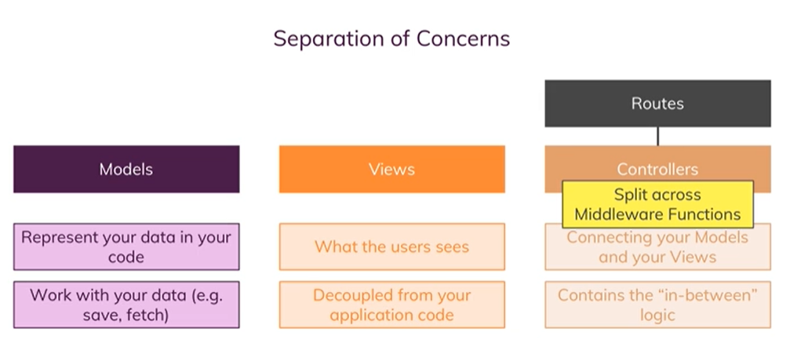

# Model View Controller (MVC)

## What does MVC mean?

### Separation of concerns



It's all about a separation of concerns, so making sure that different parts of your code do different things and you clearly know which part is responsible for what

- Models:  
    so things like saving data, fetching data to or from a file or even if it's just in memory as we're currently doing it

- Views:  
    The views are responsible for what the user sees in the end, they are responsible for rendering the right content in our html documents and sending that back to the user, so they are decoupled from your application code and are just having some light or minor integrations regarding the data we inject into our templating engine to generate these views

- Controllers:  
    And the controllers are now the connection point between the models and your views because since the views shouldn't care about the application logic and the models do care about how to save and fetch data and so on,  
    The controllers are the thing working with the models, saving that data or triggering that save process and so on, and also the part where they then pass that data that was fetched to your views
    
    **So the controller is the middleman, it contains the in-between logic.**

    Routes are basically the things which define upon which path for which http method which controller code should execute. The controller is then the thing defining with which model to work and which view to render

**<span style='color: #bcdbf9'> Note:**  in an app with express or built with express as we are doing it which heavily relies on this middleware concept, the controllers are also kind of split up across middleware functions or some of the logic might be separated and moved into another middleware function 

## Adding Controllers
**<span style='color:   #875c5c'>Important:** [https://stackoverflow.com/questions/33178843/es6-export-default-with-multiple-functions-referring-to-each-other](https://stackoverflow.com/questions/33178843/es6-export-default-with-multiple-functions-referring-to-each-other)
  
So therefore you could of course say well we already got controllers, these two files hold our controller logic and you would be right.

but as our application grows if you put everything into your route files, this can quickly become a very big file and therefore separating this into separate files can be a good idea.

>you can then quickly see which routes you have and if you want to see the code which executes per route, you simply go into the respective controller file and function.

**<span style='color: #a8c62c'> /controllers/products.js:** 
```js
function getAddProduct(req, res, next) {
  return res.render('add-product', {
    pageTitle: 'Add Product',
    path: '/admin/add-product',
  });
}

export default { getAddProduct };
```
**<span style='color: #a8c62c'> /routes/admin.js:** 
**<span style='color: #bcdbf9'>  
Note:** we don't execute our imported function from `/controllers/`, we just pass a reference to this function: So we're just telling the express router that it should take this function and store it and whenever a request reaches this route, it should go ahead and execute it.
```js
import  productsController  from "../controllers/products.js";
router.get('/add-product', productsController.getAddProduct);
```
