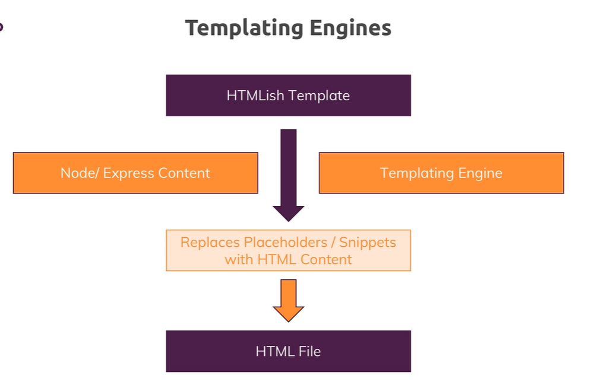

# Introduction

## Javascript on the Server


Now typically and also what we will do in this course, you use nodejs to run it on a server to write server side code and for that, we have to have a look at the full picture.

We have our users using a client computer with a browser, their mobile phone with a browser, even mobile apps and we will come back to how nodejs can communicate with these later in the course too but for now let's stick to the traditional browser picture.

We get our users using the browser and there we can use html, css and javascript, javascript in the browser to create webpages. Now they visit a page, mypage.com and they send a request to do so, for example by entering a url in the browser, a request is sent to that url.

Now there, this server comes into play. We got our server, some computer running in the Internet which has the IP associated with that domain which is automatically resolved for us and on that server, we then want to execute some code that does something with the incoming request and returns a response, often but not necessarily always as you will learn, this response is a html page which the browser then in turn can display. By the way, it is not necessarily just html, it's also things like css files or javascript files with javascript code for the browser, not for the server.

***Now on the server, we typically do tasks that we can't or don't want to do from inside the browser for performance or security reasons.***

We connect to databases for example to fetch and store data.

We do user authentication which we obviously can only do on a place the user can't access to make it more secure and avoid it being hacked.

We do it for input validation to see if a user entered a correct e-mail address, the browser can always be tricked, users can even edit their browser side code.

You can open the developer tools and start working on that page you're on but the server is of course sheltered from that, the user can't access it.

***And in general, we have our business logic on the server. Everything our user shouldn't see which takes too much time to run in the browser, where we obviously want to deliver a fast user experience or anything of that kind and that is where we use nodejs.***

### You're not limited to the server


### nodeJS' Role (in Web Development)


In general and that is the most popular thing you do with nodejs though, you use it in the context of web development and server side code.

So you use it to run a server and actually and that is an important difference to PHP.

for example, with nodejs you don't just write the code that is running on your server, you also write the server yourself, so the code that takes the incoming requests and routes them to your well other code. 

In PHP, you have extra tools like apache or nginx which run the servers which listen to incoming requests and then execute your php code, here nodejs does both.

It does that listening and it then also does whatever you want to do in your code,

And we also handle the response side not just incoming requests, you will also learn how you use nodejs to send back data to your clients, be that html pages, html pages with dynamic content or data only in the format of json or xml or even files.

### Alternatives

Alternatives to nodejs would be things like Python, also with frameworks like flask or Django or PHP wit frameworks like laravel maybe or standalone vanilla PHP of course and more, asp.net, Ruby on Rails, all that stuff, these basically are all replacements for nodejs or nodejs can be a replacement for them and there is no clear winner.

The huge advantage or one huge advantage of nodejs is that it uses Javascript, a language which you need so much in modern web development for all the frontend, for some build tools and if you then can also use it on the server side.

## REPL vs Using Files

The repl is what you use if you just type *node* into your terminal

this is of course an environment where we don't store our code in files but we write our node application with every line. The lines don't work independent from each other.

The alternative to running codes is that you execute files as we did it before 

But the repl is a great playground because we can use that to run some commands, to try out certain things because we execute code as we write it and therefore these are the two ways of running your node code.

# Javascript - A quick refresher
## JS in a Nutshell
### MDN link
[JavaScript — Dynamic client-side scripting](https://developer.mozilla.org/en-US/docs/Learn/JavaScript)
### JS Summary


>***Installing md/pdf converter***
https://github.com/puppeteer/puppeteer/blob/main/docs/troubleshooting.md  
sudo apt install libgtk-3-dev libnotify-dev libgconf-2-4 libnss3 libxss1 libasound2  
    VSCODE - F1 - Markdown pdf

## Template literals

One other feature, we'll use from time to time are template literals: https://developer.mozilla.org/en-US/docs/Web/JavaScript/Reference/Template_literals

It's a different way of writing strings.

Instead of using double or single quotation marks:

'A String'

or

"Another string"

you can use backticks (`)

`Another way of writing strings`

Now why would we use that way of creating strings?

With that syntax, you can dynamically add data into a string like this:
```js
const name = "Max";
const age = 29;
console.log(`My name is ${name} and I am ${age} years old.`);
This is of course shorter and easier to read than the "old" way of concatenating strings:
```
```js
const name = "Max";
const age = 29;
console.log("My name is " + name + " and I am " + age + " years old.");
```

[MD — Code Blocks ](https://www.codecademy.com/resources/docs/markdown/code-blocks)  
https://www.codecademy.com/resources/docs/markdown/code-blocks

# Understanding the Basics
## How the Web Works

what happens behind the scenes is actually that the browser reaches out to some domain name servers to look that domain up because this domain is not really the address of your server, it's basically an encoded human readable version of that address you could say, your server itself has just an IP address but this is just some technical thing behind the scenes.

You write the code that runs on that computer in the Internet which has that IP address, you write the code that spins up that server which is able to handle the incoming request and do something with it.


request and response transmission is done through some protocol, so basically a standardized way of communicating you could say because obviously, to correctly handle a request and send back a response the browser can work with,
>HTTPS:  SSL encryption 

## Creating a Node Server

common practise to name the main file :  server.js or app.js because it is the root file that makes up your nodejs application, so the nodejs code you will execute on a computer in the cloud on a server in the end the way javascript works both for the browser and nodejs,

there is a handful of functions and objects we can use globally without importing anything into the file but generally, most functionalities aren't available by default, to not pollute our global namespace with all these reserved keywords and names core modules: http, https, fs, path, os 

http helps us with launching a server or also with other tasks like sending requests because a node app  could also send a request to another server,

Https would be helpful when we want to launch an ssl encoded server, so where all that data which is transferred is encrypted

when importing file, 'require' automatically adds .js at the end, you don't need to add that on your own but you can.

function listen()  as you can see takes a couple of arguments, optional arguments, the first one is the port on which you want to listen. Now in production you typically would not fill this out and  it would take the default of port 80 but here on local development, we want to use a different port and you can also define a hostname.

>INFO:  The cursor here in the terminal doesn't go back in a new line because this process here is now still running, it didn't finish, this file execution didn't finish because we now get an ongoing looping process where this will keep on listening for requests

when I started out with nodejs years ago, it was difficult to understand that coming from a PHP background you suddenly write your own server, that sounded like something super complex. Well actually it's just these few lines

## Node Lifecycle & Event Loop


After creating the server, we never left that program.  
The reason for this is an important concept in nodejs called the event loop, this is basically a loop process which is managed by nodejs which keeps on running as long as there is work to do you could say, it keeps on running as long as there are event listeners registered and one event listener

we did register and we never unregistered is that incoming request listener we passed or we set up with the help of create server.

when we later access a database, you will see that there we also basically send that 'insert some data request' and then we register some function that should be executed once it's done. 
>And nodejs uses this pattern because it actually executes single threaded javascript. So the entire node process basically uses one thread on our computer it's running on.

behind the scenes, it does some multi-threading by leveraging the operating system. But this event loop is a core thing you have to keep in mind that nodejs basically has an ongoing loop as long as there are listeners and create server creates a listener which never stops but if you eventually were to unregister and you can do this with process.exit, it would end 
```js
const server = createServer((req, res) => {
  console.log(req);
  process.exit();
});
```
Process.exit basically hard exited our event loop and therefore the program shuts down because there was no more work to do.

## Parsing Request Bodies
### Streams & Buffers

The incoming data is basically sent as a stream of data and that is a special construct javascript in general knows but nodejs uses a lot, now what is such a stream of data though?

Our stream here is basically an ongoing process, the request is simply read by node in chunks, in multiple parts and in the end at some point of time it's done.  
And this is done so that we theoretically can start working on this, on the individual chunks without having to wait for the full request being read.

streaming that data could make sense because it could allow you to start writing this to your disk, so to your hard drive where your app runs, your node app runs on your server whilst the data is coming in, so that you don't have to parse the entire file which is of course taking some time and you have to wait for it being fully uploaded before you can do anything with it.

>A buffer is simply a construct which allows you to hold multiple chunks and work with them before they are released once you're done and you work with that buffer

## Understanding Event Driven code execution
createServer(), req.on(), req.end()  
These are some examples where no case uses a pattern where you pass a function to a function and node will execute these past in functions at a later point of time, which is called asynchronously.

In such cases, no charges won't immediately run that function. Instead, what it does when it first encounters this line is it will simply add a new event listener internally.

you can think of this as nodeJS as having some internal registry of events and listeners to these events.

>When the event is triggered, it will then find this function and any other functions you might have registered for that and will now call them. But it will not pause the other code execution and that is so important to understand.

if below code was encapsulted directly in the req.on() event, it would trigger a 'cannot set headers' error, as this block would only be registered the first time and not run
```js
req.on('end', () => {
    const parsedBody = Buffer.concat(body).toString();
    const message = parsedBody.split('=')[1];
    writeFileSync('message.txt', message);
    // WARN: having these line in the on() event would error, they need to be located below to run even the first time
    // res.statusCode = 302;
    // res.setHeader('Location', '/');
    // return res.end();
    });
    res.statusCode = 302;
    res.setHeader('Location', '/');
    return res.end();
```
We don't want to block our code execution. We always want to be in that wait for new events, loop the event loop and then only execute code once it's due to be executed and never block that event loop for too long of a time.

## Node.js - Behind the scenes

### Event Loop & Worker Pool


the event loop is automatically started by nodejs when your program starts, This is responsible for handling event callbacks.  

so all these nice functions we basically added thus far in create server for example, the event loop is responsible for basically running that code when a certain event occurs 

That doesn't help us with our long taking file operation though and it's important to understand that this operation is not handled by the event loop, just the callback that we might have defined on write file once it's done, that code will be handled in event loop but that code will finish fast.

Instead our file system operation and a couple of other long taking operations are sent to a worker pool which is also spun up and managed by nodejs automatically. This worker pool is responsible for all the heavy lifting.

This worker pool is kind of totally detached of your javascript code you could say and it runs on different threads, it can spin up multiple threads, it's closely intervened with your operating system you're running the app on, so this is really detached from your code and this worker pool is therefore doing all the heavy lifting.

The one connection to the event loop we will have though is that once the worker is done, so for example once we read a file, it will trigger the callback for that read file operation and since the event loop is responsible for the events and the callbacks, this will in the end end up in the event loop.

### Event Loop

Now be aware that with IO here, I mean generally any input output operations that typically is file operations but can also be network operations and in general, I'm talking about blocking long taking operations.

Now it's important to understand that nodejs will leave that phase at a certain point of time and that can also mean that if there are too many outstanding callbacks, it will continue its loop iteration and postpone these callbacks to the next iteration to execute them. After working on these open callbacks and hopefully finishing them all, it will enter a poll phase.

The poll phase is basically a phase where nodejs will look for new IO events and basically do its best to execute their callbacks immediately if possible. Now if that's not possible, it will defer the execution and basically register this as a pending callback,

Important, it also will check if there are any timer callbacks due to be executed and if that is the case, it will jump to that timer phase and execute them right away,

Now we're nearing the end of each iteration cycle and now nodejs will execute all close event callbacks, so if you registered any close events and in our code, we haven't but if you had any close events, this would be the point of time where nodejs executes their appropriate callbacks.

Well and then we might exit the whole nodejs program but only if there are no remaining event handlers which are registered and that is what I mean with this refs equal null thing here. Internally nodejs keeps track of its open event listeners and it basically has a counter, references or refs which it increments by 1 for every new callback that is registered, every new event listener that is registered.  
It reduces that counter by 1 for every event listener that it doesn't need anymore.


In a server environment,  we create a server with create server and then listen to incoming requests with listen, this is an event which never is finished by default and therefore, we always have at least one reference and therefore we don't exit in a normal node web server program. We can call the exit function as you already saw.

## Module Summary


# Improved Development Workflow and Debugging

## NPM Scripts
We have to use npm, npm stands for node package manager and it is installed together with nodejs

we can also use npm to initialize a so-called node project or to add some extra features to it to be precise because we obviously already got a node project here but now in this project, in a terminal navigated into this project, you can run npm init.

So with this what you get is this package.json file and there you also see all these settings or configurations you just set up and you can of course edit them there too,

JSON format; the keys are always put between double quotation marks and so are the values, 


with this configuration file, you'll see that we got a scripts section 

```json
  "scripts": {
    "test": "echo \"Error: no test specified\" && exit 1",
    "start": "node app.js",
    "start-server": "node app.js"
  },
```
with other script names you have to pass: 'npm run *scriptName*'

start just is a special case which works with 'npm start' .

## Third Party Packages
Third-party packages are available through the npm repository, that is a cloud package repository where all these packages live and you can conveniently install and manage them via npm,

### NPM link
[https://www.npmjs.com/package/nodemon](https://www.npmjs.com/package/nodemon)

packages which you install can be divided into development packages, so packages which mostly help you during development and production dependencies, so packages that helps you for the app as it's running on a server, for example nodemon would be a development dependency because we only use it during the development process, once we install our app on a real server we don't need it there.

The real server which is running somewhere in the Internet of course shouldn't restart and it also doesn't have to because we'll not change its code dynamically. A dev dependency will be added in your package.json

>-g, it will not install it in this project but globally on your machine so that you can use it anywhere.

```
npm install nodemon --save-dev
npm install nodemon -g
```

where is it installed? Well that is the **node_modules** folder

So you need that node modules folder while still using the packages but if you're not working on the project, you can delete it if you want, if you need the free space and then just remember to rerun npm install once you are working on the project again.

The **package-lock.json** file by the way just stores the exact versions I installed today so that if you share your project with others, they can actually get these exact versions too instead of the latest versions

## Global Features vs Core Modules vs Third-Party Modules
The last lectures contained important concepts about available Node.js features and how to unlock them.

You can basically differentiate between:

- **Global features**: Keywords like const or function but also some global objects like process

- **Core Node.js Modules**: Examples would be the file-system module ("fs"), the path module ("path") or the Http module ("http")

- **Third-party Modules**: Installed via ```npm install``` - you can add any kind of feature to your app via this way

**Global features are always available**, you don't need to import them into the files where you want to use them.

**Core Node.js Modules** don't need to be installed (NO npm install is required) but you **need to import them** when you want to use features exposed by them.

Example:

```const fs = require('fs');```

You can now use the ```fs``` object exported by the "fs" module.

**Third-party Modules need to be installed** (via ```npm install``` in the project folder) **AND imported.**

Example (which you don't need to understand yet - we'll cover this later in the course):
```js
// In terminal/ command prompt
npm install --save express-session
// In code file (e.g. app.js)
const sessions = require('express-session');
```

## Global & Local npm Packages
In the last lecture, we added ```nodemon``` as a local dependency to our project.

The good thing about local dependencies is that you can share projects **without the node_modules** folder (where they are stored) and you can run npm install in a project to then re-create that node_modules folder. This allows you to share only your source code, hence reducing the size of the shared project vastly.

The attached course code snippets also are shared in that way, hence you need to run ```npm install``` in the extracted packages to be able to run my code!

>I showed that ```nodemon app.js``` would **not work** in the terminal or command line <ins>because we don't use local dependencies there but global packages.</ins>

You could install ```nodemon``` globally if you wanted (this is NOT required though - because we can just run it locally): ```npm install -g nodemon``` would do the trick. Specifically the ```-g``` flag ensures that the package gets added as a global package which you now can use anywhere on your machine, directly from inside the terminal or command prompt.

## Restarting the Debugger Automatically

we have to go to debug and then **Add a configuration** for nodejs.

This adds the .vscode folder with the ```launch.json``` file and this allows you to configure debugging for this project and how it behaves.

```"restart": true```

You have to make sure that **nodemon** is used and for that, you set the runtime executable not to node which would be the default
```"runtimeExecutable": "nodemon"```

With this if you save all of that and you now start debugging, it fails though and the reason for this is that <ins>it will not use the local nodemon but it looks for it globally.</ins>

Now to add it globally, you have to run ```npm install nodemon -g```, add **sudo** for Linux infront

### [https://code.visualstudio.com/docs/nodejs/nodejs-debugging](https://code.visualstudio.com/docs/nodejs/nodejs-debugging)
### Node console
you have to stop that process separately which you can do from the terminal which is why if you are using that nodemon process, you should use the integrated terminal 
>By default, Node.js debug sessions launch the target in the internal VS Code Debug Console. Since the Debug Console does not support programs that need to read input from the console, you can enable either an external terminal or use the VS Code Integrated Terminal by setting the console attribute in your launch configuration to externalTerminal or integratedTerminal respectively. The default is internalConsole.  
```"console": "integratedTerminal"```  
```cwd``` - launch the program to debug in this directory. 
>>**It is important to define this parameter if you use relative path, and debug with node && nodemon**

### [Link: Debugging Node.js](https://nodejs.org/en/learn/getting-started/debugging)


# Working with Express.js

##   Installing Express.js

### Install
So let's now install expressjs by running ```npm install --save express```,  
Because this will be a **production dependency**. We don't just use that as a tool during development, it will be an integral part of the application we ship and therefore, it definitely also has to be installed on any server or any computer where we run our application once we deploy it.

We will also install nodemon as a dev-dependency:
```json
 "devDependencies": {
    "nodemon": "^3.1.0"
  },
  "dependencies": {
    "express": "^4.19.2"
  }
```
### Express package
If you hold ```Ctrl+ left mouse click``` on your the <ins>'express'</ins> area of your import ```import { express  } from 'express';```, you'll get to the **source code of Express.js**.

you can see that a function is exported at the end of the file:  
```export = e;```, note that it is a *Definition Typescript file (d.ts)*

>We have now initialized a new app constant/object  
```const app = express();```  
>>so a lot of logic is in this app constant here. Now the app here actually also happens to be a valid request handler, so you can pass app here to create server and if you do that and you run npm start, you will actually have a running server which of course will not handle any requests though because we haven't defined any logic that should happen for incoming requests app will basically not do anything at this point.  
```const server = createServer(app);```

Well almost, it does one thing for you and that is it sets up a certain way of handling incoming requests that defines or that is a key characteristic of expressjs

>HACK: it is important to import express.js as below  
`import  express  from 'express';`  
and not: `import  { express }  from 'express';`

## Middleware


Expressjs is all about middleware and you see a diagram here, middleware means that an incoming request is *automatically funneled through a bunch of functions by expressjs*.

so instead of just having one request handler, you will actually have a **possibility of hooking in multiple functions which the request will go through until you send a response.**

This allows you to split your code into multiple blocks or pieces instead of having one huge function that does everything.
This is the pluggable nature of expressjs, where you can easily add other third party packages which simply happen to give you such middleware functions that you can plug into expressjs and add certain functionalities.

### use()
So this is a core concept of expressjs: the middleware. And we can use that by going here after we created the app object but before we passed it to create server and then we can use the app and call a method which is defined by the express framework, `use()`.
> `use()` allows us to add a new middleware function, it accepts an array of so-called request handlers

<ins>this function you pass to app use will be executed for every incoming request</ins> and this function will receive three arguments:

- the request
- the response object
- a third argument which is the **next argument.**

`next` is actually a function, a function that will be passed to this function by expressjs and this can be confusing because you are passing a function as an argument to the `use()` method and this function you're passing is receiving yet another function here on the next argument.

>and this next argument, basically this function you're receiving here has **to be executed to allow the request to travel on to the next middleware.**

**<span style='color:   #875c5c'>IMPORTANT:** our page will keep on spinning,  so we don't get a response which makes sense because we've got no logic where we would send one.  

If we don't call next, we should actually send back a response because otherwise the request can't continue its journey, so it will never reach a place where we might send a response.

[https://www.color-hex.com/color-palettes/](https://www.color-hex.com/color-palettes/)    

## Sending Response

Sending responses actually gets easier, thanks to expressjs.

Instead of setting a *header* which we still can do and writing *write(*) which we also still can do, so we can still send responses as before but instead, there is a new utility function we can use, `send()`.

### HTML
we can still send HTML .
And another feature provided by express here. The send method by default here since we send some text is  simply sets an *html content type*.  
you can still set one manually with `seHheader()` of course, so you can always override this expressjs default but you can also rely on the default where the default response header is text html.

sending a file with express.js will be even easier compared to raw node.js

>Basic middleware concept: you add functions that are hooked into this funnel through which the request goes and you either have next to reach the next middleware or you send a response.

## Creating HTML pages

Moving towards a MVC, a model view controller structure, one part of it is that we manage our views, so what we serve to the user in one place of our application in the views folder.

## Serving HTML Files

in our routes files, whenever we use the `res.senfFile()` method, we have an error.  
The reason for this is that an absolute path would be correct, but slash `\`, actually refers to our root folder on our operating system,   not to this project folder.

So in order to construct the path to this directory and this file here ultimately, we can use a feature provided by **nodejs, another core module**. We can import the path core module by requiring `path`.

`Join()` yields us a path at the end, it returns a path but it constructs this path by concatenating the different segments.

Now the first segment we should pass here is then actually a **global variable** made available by nodejs: `__dir name`.
>**<span style='color:   #875c5c'>Important:** This is a global variable which simply holds the absolute path on our operating system to this project folder

Don't add  */* as use `path.join()`, using path join will automatically build the path in a way that works on *both Linux systems and Windows systems*.

>**<span style='color:   #875c5c'>Important:** With modern ES6 Modules, you can't use directly `__dirname`, instead:
```js
import { fileURLToPath } from 'url';
const __filename = fileURLToPath(import.meta.url);
const __dirname = path.dirname(__filename);
```
>[https://flaviocopes.com/fix-dirname-not-defined-es-module-scope/](https://flaviocopes.com/fix-dirname-not-defined-es-module-scope/)

## Using a helper function for Navigation

>`path.dirname(require.main.filename);`  
This will refer to the main, well module that started your application, so basically to the module we created here in app.js, and now we can call file name to find out in which file this module was spun up.

So put in other words, this gives us the path to the file that is responsible for the fact that our application is running and this file name is what we put into dir name to get a path to that directory.

>**<span style='color:   #875c5c'>important:** for ES6 module, you have to use `path.dirname(process.argv[1]);`:  
*source*: [https://2ality.com/2022/07/nodejs-esm-main.html](https://2ality.com/2022/07/nodejs-esm-main.html)
*source*: [stackoverflow alternative-for-require-main-filename-using-es6-modules](https://stackoverflow.com/questions/72153742/alternative-for-require-main-filename-using-es6-modules)

## Serving Files statically

>the convention is to call it public because you want to indicate that this is a folder that holds content which are always exposed to the public crowd or which is always exposed to the public, 

All your files in the Node.js project are not accessible by your users, if you ever tried to enter localhost and then something like views, shop.html, that will not work because this is simply accepted by express and it tries to find a route that matches this.

you can't access the file system  and that is of course good and what you want.

But now I actually want to make an exception, I want that some requests can just access the file system because ultimately let's say in shop.html, I want to have something like a link in here where I simply point at something like css, main.css,

>**<span style='color:   #875c5c'>important:** we need a feature expressjs offers us, we need to be able **to serve files statically** and ***statically simply means not handled by the express router or other middleware but instead directly forwarded to the file system.***  
>>And for this, we register a new middleware with app use and this this one expressjs ships with, therefore we use the express object itself,  
```js
app.use(express.static(path.join(__dirname, 'public')));
```

And here again we can construct this path with path join and then simply our dir name, so our root folder and then public because I want to grant access to the public folder in our current folder here.

*Express.js* will take any request that tries to find some file and it looks at the extension, so anything that tries to find a `.css` or a `.js` files, if we have such a request, it automatically forwards it to the **/public** folder and therefore then the remaining path has to be everything but that public,
```html
<link rel="stylesheet" href="/css/main.css">
```
**<span style='color:   #875c5c'>important:** you could register multiple static folders and it will funnel the request through all of them until it has a first hit for the file it's looking for.

and you're not just limited to css and javascript files, you can also serve images and so on.

## Express.js: Wrap Up

By using expressjs, a powerful framework and that is what expressjs is. It's a nodejs framework, so you still use nodejs.

We for example still use the path core module in this module but you build up on it and get a bunch of utility functions and a clear set of rules on how you should structure your app and it's all about middleware and understanding that flow of requests through all the middleware functions. 


# Working with Dynamic Content  & Adding Templating Engines

## Sharing Data Across Requests & Users

If we are now in Firefox here and I also visited localhost 3000.

So this is a totally different browser and this is kind of like a brand new user, it doesn't share any cookies with the other browser, nothing of that kind, it used the same IP address but that doesn't matter here.
if we visit the `/add-product` route, we see that our `const products = array ` is actually **data which is inherent to our node server** as it is running and therefore, it's shared across all users.

**<span style='color:   #875c5c'>Important:** actually you will probably never implement this, you always want to fetch data for a specific request and if that happens to be the same data you show for all users that send this request, this is fine.

But sharing this data across requests, across users is typically something you don't want to do because if you now edit this with user A, user B will see the updated version.

>So this is a pattern we can use for now here and it's fine for practicing what we want to practice here but later we'll learn about a technique to share data in memory here, in the node app across different requests but only for one and the same user and not across users because now we have shared data across requests and across users.  
we will also use database.

## Templating Engines


A templating engine understands a certain syntax for which it scans your html-ish template and where it then replaces placeholders or certain snippets depending on the engine you're using with real html content but that content, this **html content it uses there is generated on the fly, on the server by the templating engine taking that dynamic content into account.**
>With a templating engine, in the end, the result will be dynamically, on the fly generated html file which is then sent back to your users.  
So the users never see the template, they never see the placeholders, **all that happens on the server,** they just get a normal html page but it's not hardcoded 

The 3 most popular templating engines are:
- EJS
- Pug (Jade)
- Handlebars

## Installing &  Implementing Pug

**<span style='color: #bcdbf9'> Note:** remember that we must quit the development server when we install another package.

`npm install --save ejs pug express-handlebars` (So let's install them with npm install --save because all three engines are part of our node code and ship with the code we deploy on some computer in the end)

We need to install a global configuration value; `app.set()` allows us to set any values globally on our express application  
[https://expressjs.com/en/api.html#app.set](https://expressjs.com/en/api.html#app.set)


| Property    | Description | Default |
| -------- | ------- | ------- |
| view engine  | The default engine extension to use when omitted. NOTE: Sub-apps will inherit the value of this setting.    | |
| views | 	A directory or an array of directories for the application's views. If an array, the views are looked up in the order they occur in the array. | `process.cwd() + '/views'` |

```js
app.set('view engine', 'pug');
```
**<span style='color: #bcdbf9'> Note:** **Pug** engine actually ships with built in express support and auto registers itself with express.  
Pug is supported out of the box and with that, we're already set to go.


>**<span style='color: #cc9464'> HACK:** Thanks to our IDE/Emmet, if you `CTRL+Enter HTML:5`, we get a **Pug** structure.  
Keep in mind that the **Pug** templating engine will compile our code to normal html in the end.

Indentation matters with **Pug**, to manage siblings.

As we defined that all the views are in the `/views` folder, we also don't have to construct a path to that folder instead we can just say `'shop'`.  
We also don't need shop.pug because we defined pug as the default templating engine so it will look for `.pug file`

From shop.js,
```js
router.get('/', (req, res, next) => res.render('shop'));
```
## Official Pug Documentation
[https://pugjs.org/api/getting-started.html](https://pugjs.org/api/getting-started.html)

## Adding a Layout
**<span style='color: #bcdbf9'> Note:** we can define some hooks in the base layout, and other views that will extend the base layout, can add more *links references* for example (you can choose whatever name after the reserved keyword **block**):     
`block styles`  
`block content`

**<span style='color: #a8c62c'> main-layout.pug:** 

```html
<!DOCTYPE html>
html(lang="en")
    head
        meta(charset="UTF-8")
        meta(name="viewport", content="width=device-width, initial-scale=1.0")
        meta(http-equiv="X-UA-Compatible", content="ie=edge")
        title #{pageTitle}
        link(rel="stylesheet", href="/css/main.css")
        block styles
    body   
        header.main-header
            nav.main-header__nav
                ul.main-header__item-list
                    li.main-header__item
                        a(href="/", class=(path === '/' ? 'active' : '')) Shop
                    li.main-header__item
                        a(href="/admin/add-product", class=(path === '/admin/add-product' ? 'active' : '')) Add Product
        
        block content
```

**<span style='color: #a8c62c'> 404.pug:** 
```html
extends layouts/main-layout.pug

block content
    h1 Page Not Found!
```
**<span style='color: #a8c62c'> add-product.pug:** 
```html
extends layouts/main-layout.pug

block styles
    link(rel="stylesheet", href="/css/forms.css")
    link(rel="stylesheet", href="/css/product.css")

block content
    main
        form.product-form(action="/admin/add-product", method="POST")
            .form-control
                label(for="title") Title
                input(type="text", name="title")#title
            button.btn(type="submit") Add Product
```

## Finishing Pug template
### Active item `navbar`

**<span style='color: #a8c62c'> admin.js:** 
```js
router.get('/add-product', (req, res, next) =>
  res.render('add-product', { pageTitle: 'Add Product', path: '/admin/add-product' })
);
```
**<span style='color: #a8c62c'> main-layout.pug:** 
```
li.main-header__item
    a(href="/", class=(path === '/' ? 'active' : '')) Shop
li.main-header__item
    a(href="/admin/add-product", class=(path === '/admin/add-product' ? 'active' : '')) Add Product
```

### Passing the PageTitle
*Option 1*: we could create a block section in **<span style='color: #a8c62c'> main-layout.pug:**  , and define it in our views

*Option 2*: we use a dynamic field in **<span style='color: #a8c62c'> main-layout.pug:**   
`title #{pageTitle}`

**<span style='color:   #875c5c'>IMPORTANT:** we need to make sure that in all our `res.render()` function, we pass that `pageTitle` key.

## Working with Handlebars

### Official Handlebars Documentation
[https://handlebarsjs.com/](https://handlebarsjs.com/)

### Set-up
**<span style='color: #bcdbf9'> Note:** Unlike Pug, Handlebars is not auto-installed by Express,js, so we manually have to tell express that there is such an express handlebars engine available.

so that object we just imported, that just turns out to be a function that we can call to basically initialises this engine 

**<span style='color:   #875c5c'>IMPORTANT:** **applies up to version 3**

```js
import expressHbs from 'express-handlebars';
app.engine('handlebars', expressHbs());
app.set('view engine', 'handlebars');
```
Note that the extension for you files in `views` folder,  will follow the convention you defined your app.set() function  
- 'handlebars' => **<span style='color: #a8c62c'> *404*.handlebars**  
- 'hbs' => **<span style='color: #a8c62c'> *404*.hbs**

**<span style='color:   #875c5c'>IMPORTANT:** **set-up with current version (at the the time of the course 7.1.2**  
[https://www.npmjs.com/package/express-handlebars](https://www.npmjs.com/package/express-handlebars)

```js
import { engine } from 'express-handlebars';
app.engine('handlebars', engine());
app.set('view engine', 'handlebars');
app.set('views', './views');
```
you must have a **<span style='color: #a8c62c'>main.handlebars** file under `/views/layouts`

### Handlebars syntax
Handlebars uses normal html with some custom syntax, there is no minimal html version as it was with Pug.
```html
<title>{{ pageTitle }}</title>
```

Handlebars just supports output of keys that yield true or false.  
`{{ #if prods.length > 0}}`  

Now this means that we have to move that logic from the template into our
 Node Express code and pass the result of this check into the template.

This is a core difference to Pug already besides that html syntax. In Handlebars, we can't run any logic in our handlebars template, we just can output single property, single variables and their value and we can only use these in `if blocks`.

**<span style='color: #bcdbf9'> Note:** it might sound very complex but it forces us to put all our logic into the node express code where our logic typically should live and keep our templates lean because if you put too much logic in your templates, it can be hard to understand your code because you always have to check both, your express code and your templates

## Adding a Layout with Handlebars
you define layout folder and default template:  
```js
app.engine('handlebars', engine({layoutsDir: 'views/layouts/', defaultLayout: 'main-layout'}));
```

Unlike Pug , you can't define block section, instead the only thing we can do there is we can define a placeholder with three curly braces, `{{{body}}}`

However if you have some part like this where you need to add some styling depending on the page you are on, you will have to solve this differently, in a kind of a similar approach as we solved the active lass here in pug, you will have to add an if statement here in your main layout

**<span style='color: #a8c62c'>main-layout.handlebars**  
```js
{{#if productCSS}}
    <link rel='stylesheet' href='/css/forms.css' />
{{/if}}
{{#if formsCSS}}
    <link rel='stylesheet' href='/css/product.css' />
{{/if}}

<li class='main-header__item'>
    <a class='{{#if activeShop}}active{{/if}}' href='/'>Shop</a>
</li>
<li class='main-header__item'>
    <a class='{{#if activeAddProduct}}active{{/if}}' href='/admin/add-product'>Add Product</a>
</li>
```

**<span style='color: #a8c62c'>shop.js**  
```js
router.get('/', (req, res, next) =>
  res.render('shop', {
    prods: adminData.products,
    pageTitle: 'My Shop',
    path: '/',
    hasProducts: adminData.products.length > 0,
    activeShop: true,
    productCSS: true,
  })
);
```

**<span style='color: #bcdbf9'> Note:**  for any views you can pass `layout: false` in your `res.render()`, this is a special key that is understood by handlebars and it would not use the default layout,

### renaming .handlebars extension to .hbs
**<span style='color: #a8c62c'>app.js**, you have to add an extname property in your engine configuration:
```js
app.engine(
  'hbs',
  engine({
    layoutsDir: 'views/layouts/',
    defaultLayout: 'main-layout',
    extname: 'hbs',
  })
);
app.set('view engine', 'hbs');
app.set('views', './views');
```

## Working with EJS

### Official EJS Documentation
[http://ejs.co/#docs](http://ejs.co/#docs)

EJS is a templating engine which is just like pug, supported out of the box so we don't need to register the engine as we did it with handlebars.

It has a nice mixture of the extended functionalities of Pug, and uses normal HTML.

ejs does not support layouts but we will find a solution to at least have some kind of reusability of certain building blocks

**<span style='color: #bcdbf9'> Note:** we can write normal javascript code in blocks like `if`, `for`:
```html
<% if (prods.length >0) %>

<% if (prods.length >0) { %>
    <div class="grid">
    <% for (let product of prods) { %>
    <article class="card product-item">
```
## Working on layouts with EJS Partials
One thing that is missing here is the layout functionality pug or handlebars gave us and indeed ejs doesn't have layouts but we can use so-called **partials or includes**, by the way a feature that pug and handlebars also know.

Instead of having one master layout where you put your individual view parts into, you have a couple of separated shared view parts which you can merge into the views

Create a folder `includes` under `/views`

to use our **partials**, taking the example of **<span style='color: #a8c62c'>404.ejs**
We need to import it and this can be imported into the 404.ejs file by adding our ejs syntax, using a **minus sign** and you use that if you want to output **unescaped html code**, if you would render some variable that holds a string that holds html code, it would not render that html code but render it as text to avoid cross-site scripting attacks, with a minus you can avoid this and really render the html code.

```html
<%- include('includes/head.ejs') %>
```

if instead we use an **equal sign**, it gets rendered as text, this is escaping the values so it's not rendering it. So if you had some script tag or anything fishy in there, it would not render it. it would just display it as text and therefore protect you, but if you know what you're doing like we do here because we wrote the code we're including, we can and we should of course include it as html.
```html
<%= include('includes/head.ejs') %>
```

To manage the active class of the header/navigation, we can use this code, with the ejs syntax:
```html
<li class="main-header__item"><a class="<%= path === '/' ? 'active' : '' %>" href="/">Shop</a></li>
<li class="main-header__item"><a class="<%= path === '/admin/add-product' ? 'active' : '' %>" href="/admin/add-product">Add Product</a></li>
```

Note: in any `.ejs` file you can add ejs syntax to console.log something
`<% console.log(path); %>`

**<span style='color: #a8c62c'>404.ejs** using **partials**
```html
<%- include('includes/head.ejs') %>
  </head>
  <%- include('includes/navigation.ejs') %>
  <body>
    <main>  
      <h1>Page Not Found!</h1>
    </main>
<%- include('includes/end.ejs') %>
```
# Model View Controller (MVC)

## What does MVC mean?

### Separation of concerns


It's all about a separation of concerns, so making sure that different parts of your code do different things and you clearly know which part is responsible for what

- Models:  
    so things like saving data, fetching data to or from a file or even if it's just in memory as we're currently doing it

- Views:  
    The views are responsible for what the user sees in the end, they are responsible for rendering the right content in our html documents and sending that back to the user, so they are decoupled from your application code and are just having some light or minor integrations regarding the data we inject into our templating engine to generate these views

- Controllers:  
    And the controllers are now the connection point between the models and your views because since the views shouldn't care about the application logic and the models do care about how to save and fetch data and so on,  
    The controllers are the thing working with the models, saving that data or triggering that save process and so on, and also the part where they then pass that data that was fetched to your views
    
    **So the controller is the middleman, it contains the in-between logic.**

    Routes are basically the things which define upon which path for which http method which controller code should execute. The controller is then the thing defining with which model to work and which view to render

**<span style='color: #bcdbf9'> Note:**  in an app with express or built with express as we are doing it which heavily relies on this middleware concept, the controllers are also kind of split up across middleware functions or some of the logic might be separated and moved into another middleware function 

## Adding Controllers
**<span style='color:   #875c5c'>Important:** [https://stackoverflow.com/questions/33178843/es6-export-default-with-multiple-functions-referring-to-each-other](https://stackoverflow.com/questions/33178843/es6-export-default-with-multiple-functions-referring-to-each-other)
  
So therefore you could of course say well we already got controllers, these two files hold our controller logic and you would be right.

but as our application grows if you put everything into your route files, this can quickly become a very big file and therefore separating this into separate files can be a good idea.

>you can then quickly see which routes you have and if you want to see the code which executes per route, you simply go into the respective controller file and function.

**<span style='color: #a8c62c'> /controllers/products.js:** 
```js
function getAddProduct(req, res, next) {
  return res.render('add-product', {
    pageTitle: 'Add Product',
    path: '/admin/add-product',
  });
}

export default { getAddProduct };
```
**<span style='color: #a8c62c'> /routes/admin.js:**  
**<span style='color: #bcdbf9'>  Note:** we don't execute our imported function from `/controllers/`, we just pass a reference to this function: So we're just telling the express router that it should take this function and store it and whenever a request reaches this route, it should go ahead and execute it.
```js
import  productsController  from "../controllers/products.js";
router.get('/add-product', productsController.getAddProduct);
```

## Adding a Product Model
**<span style='color: #bcdbf9'>  Note:**  whilst this might look more complicated right now and it certainly is because we're just using our dummy storage here, this is great once you really got more complex models with more fields, with more methods and where you don't store them in some random array but where you got the whole database connection logic

**<span style='color: #a8c62c'> /models/product.js:**  
```js
const products = [];

class Product {
  constructor(title) {
    this.title = title;
  }
  save() {
    products.push(this);
  }

  static fetchAll() {
    return products;
  }
}

export default Product;
```

**<span style='color: #a8c62c'> /controllers/products.js:**  
**<span style='color:   #875c5c'>Important:** convention is to use Capital letter for ES6 classes *import Product...*:
```js
import Product from '../models/product.js';

function postAddProduct(req, res, next) {
  new Product(req.body.title).save();
  res.redirect('/');
}

function getProducts(req, res, next) {
  res.render('shop', {
    prods: Product.fetchAll(),
    pageTitle: 'My Shop',
    path: '/',
  });
}
``` 

## Storing data in files via the Model
**<span style='color: #a8c62c'> /models/product.js:**

- construct the path where to save the file
- we retreive the existing content using `readFile()` and parse it if no error, otherwise contine; using an `if(!err)` block. 
  - for very big files, there are more efficient ways because you don't want to read them all into memory before you work with them, you can read them as a stream 
- add the new product and write the file in `.json` format.

Make the necessary imports:
```js
import { readFile, writeFile } from 'fs';
import path from 'path';
import { fileURLToPath } from 'url';

const __filename = fileURLToPath(import.meta.url);
const __dirname = path.dirname(__filename);
```
**<span style='color: #bcdbf9'>  Note:**  we push `this`; **the class**, and this works as we're using arrow function  
```js
 save() {
    const p = path.join(path.dirname(__dirname), 'data', 'products.json');

    readFile(p, (err, fileContent) => {
      let products = [];
      if (!err) {
        products = JSON.parse(fileContent);
      }
      products.push(this);
      writeFile(p, JSON.stringify(products), () =>  {});
    });
  }
```
**<span style='color: #bcdbf9'>  Note:** `writeFile(p, JSON.stringify(products), () =>  {});` `fs.writeFile()` takes 3 arguments: the path, the buffer to write, and an error callback  
as an alternative to pass a standard callback; `err => console.log(err)`, we pass an empty callback `() => {}`

**<span style='color:   #875c5c'>Important:** you must add the below lines in the `package.json` to avoid **nodemon** server restarting each time the `/data/products.json` changes!
```json
  "nodemonConfig": {
    "ignore": [
      "data/products.json"
    ]
  }
```

## Fetching data in files via the Model
**<span style='color:   #875c5c'>Important:** This line of code is asynchronous:  
`fs.readFile()`  
So my fetch all method here executes the line of code, and as you learned, it simply registers this callback in its event emitter registry but then it just finishes with this function and this function itself does not return anything.   
**so fetch all does not return anything**, it returns **undefined** therefore and hence in my view, we get various errors.

>**<span style='color: #cc9464'> HACK:**   I will simply accept an argument in `fetchAll()` and that's a callback function.  
and that actually allows me to pass a function into `fetchAll()`, which it will execute once it is done.  

>alternative would be to promisify the `fs.readFile()` function and use `.then()`. Note that async/await is not provided out of the box from `fs`  
[https://www.geeksforgeeks.org/how-to-operate-callback-based-fs-writefile-method-with-promises-in-node-js/](https://www.geeksforgeeks.org/how-to-operate-callback-based-fs-writefile-method-with-promises-in-node-js/)

**<span style='color: #a8c62c'> /models/product.js:**
```js
 static fetchAll(cb) {
    const p = path.join(path.dirname(__dirname), 'data', 'products.json');

    readFile(p, (err, fileContent) => {
      if (err) {
        return cb([]);
      }
      return cb(JSON.parse(fileContent));
    });
  }
```
**<span style='color: #a8c62c'> /controllers/products.js:**  
I now simply have to pass in an **anonymous function** to `fetchAll()`, the required callback function; in our case `res.render(...)`  
```js
function getProducts(req, res, next) {
  Product.fetchAll(products => {
    res.render('shop', {
      prods: products,
      pageTitle: 'My Shop',
      path: '/',
    });
  });
}
```

`fetchAll()` takes a function it should execute once it's done and once it's done, we get the products.

## Refactoring the file storage code

we will create a helper function that  will do:
- path construction here for me 
- it will also read the file, so it will basically do everything of `fetchAll()`, 
- it will even get my callback as an argument

>**<span style='color:   #875c5c'>Important:**  make sure to always use arrow functions so that this never loses its context and always refers to the class and therefore to the object based on the class

**<span style='color: #bcdbf9'>  Note:** 
- we create an internal helper function in our **<span style='color: #a8c62c'> /models/product.js:** 
- in this helper function, when there are products, we return two arguments to the callback functions
  - the products read from file 
  - **the path that `writeFile()` will take in the `save()` method** (alternative would be to create p as a global property)

```js
const _getProductsFromFile = cb => {
  const p = path.join(path.dirname(__dirname), 'data', 'products.json');

  readFile(p, (err, fileContent) => {
    if (err) {
      return cb([]);
    }
    return cb(JSON.parse(fileContent), p);
  });
};
```
in the save method, we are doing more or less the same logic as fetchAll, we just need to add the logic/callback to be executed when our `_getProductsFromFile()` has finished:
- adding the new product
- writing the file
```js
 save() {
    _getProductsFromFile((products, pathFromCallback) => {
      products.push(this);
      writeFile(pathFromCallback, JSON.stringify(products), () => {});
    });
  }
```
## Wrap-up


# Dynamic Routes & Advanced Models

## Addng the Product ID to the path
### NPM uuid
> [https://www.npmjs.com/package/uuid](https://www.npmjs.com/package/uuid)

```js
import { v4 as uuidv4 } from 'uuid';
uuidv4(); // ⇨ '9b1deb4d-3b7d-4bad-9bdd-2b0d7b3dcb6d'
```
**<span style='color: #a8c62c'> /views/shop/product-list.js:** 
```html
<a href="/products/<%= product.id  %>"
```
Our URL now returns th id: http://localhost:3000/products/664a6f0d-e067-43f4-9b07-7aa51e10dfb3  